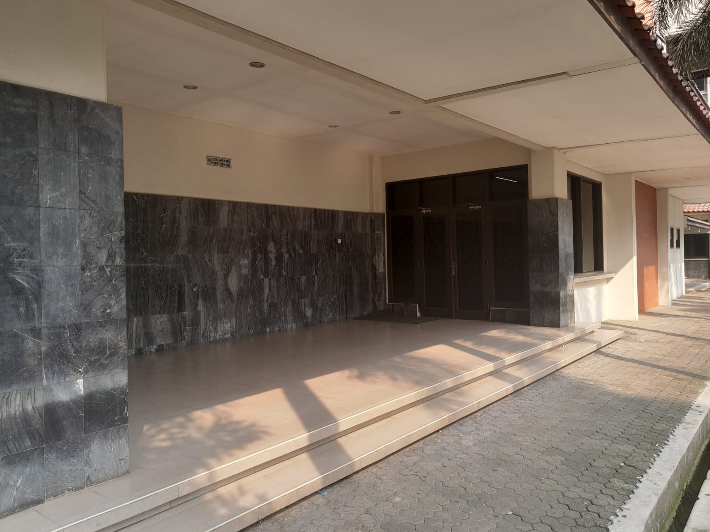
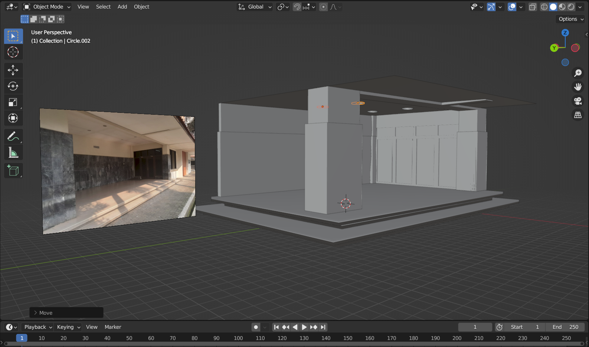
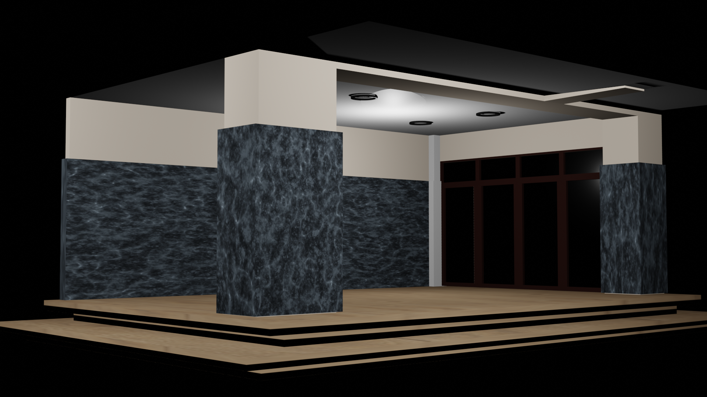

# kelompok_gk_teras

Anggota Kelompok
- Abdul Holik
- Aprisca Rexza Pamungkas
- Muhammad Izdihar

Model Blender yang dibuat adalah teras kampus Gunadarma

List Gambar
- nocolor.png : screenshot model 3d tanpa tekstur
- referensi.jpeg : referensi pembuatan model 3d
- render.png : hasil rendering model 3d
- textures(file) : berisi tekstur yang digunakan pada model 3d

File Blender
- Teras.blend (file utama)
- Teras.blend1 (backup)

Referensi

Tanpa Warna

Hasil Render

